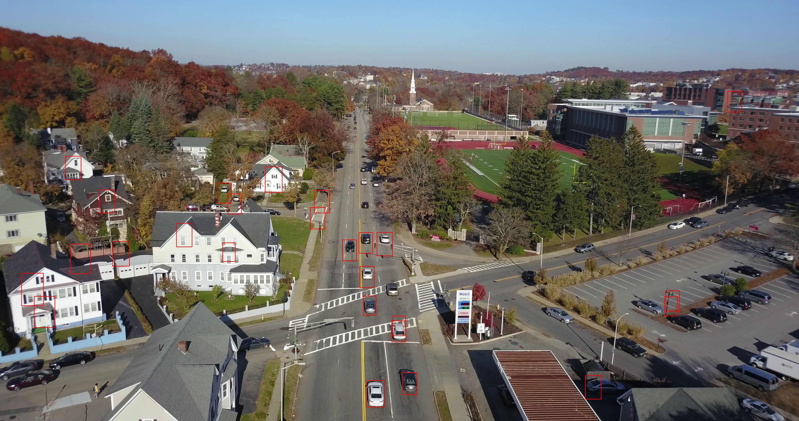

# Pedestrian and Vehicle detection using HOG+SVM
Detect Pedestrian and Vehicle separately
## File Introduction
`crop_pipeline.py` crops the `VisDrone` data. You can find `VisDrone` data [here](http://aiskyeye.com/)  
`image_processing` resize images in three ways  
`train.py` extract HOG descriptor features and train with their labels in an SVM  
`hog_visualization.py` plot an HOG feature  
`detection_video.py` produce videos using the SVM trained in `train.py`
## Dependencies
`pip install numpy`  
`pip install pandas`  
`pip install opencv-python`  
`pip install matplotlib`  
`pip install pillow`  
## Sample Detection Output
Pictures:  
Pedestrians in Blue Rectangles

Vehicles in Red Rectangles

Video:  
You may find a video [here](https://drive.google.com/file/d/1bT5T-uOxW0pSUzrETqtytdzKjgnnHw4y/view?usp=sharing)
